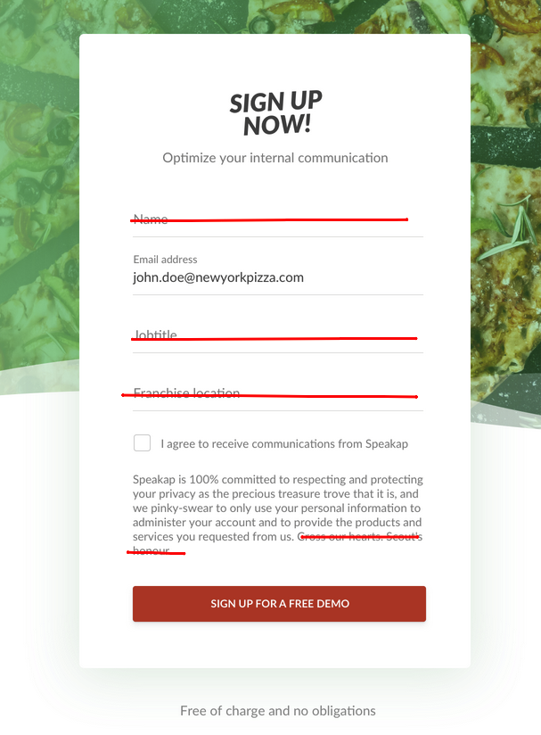
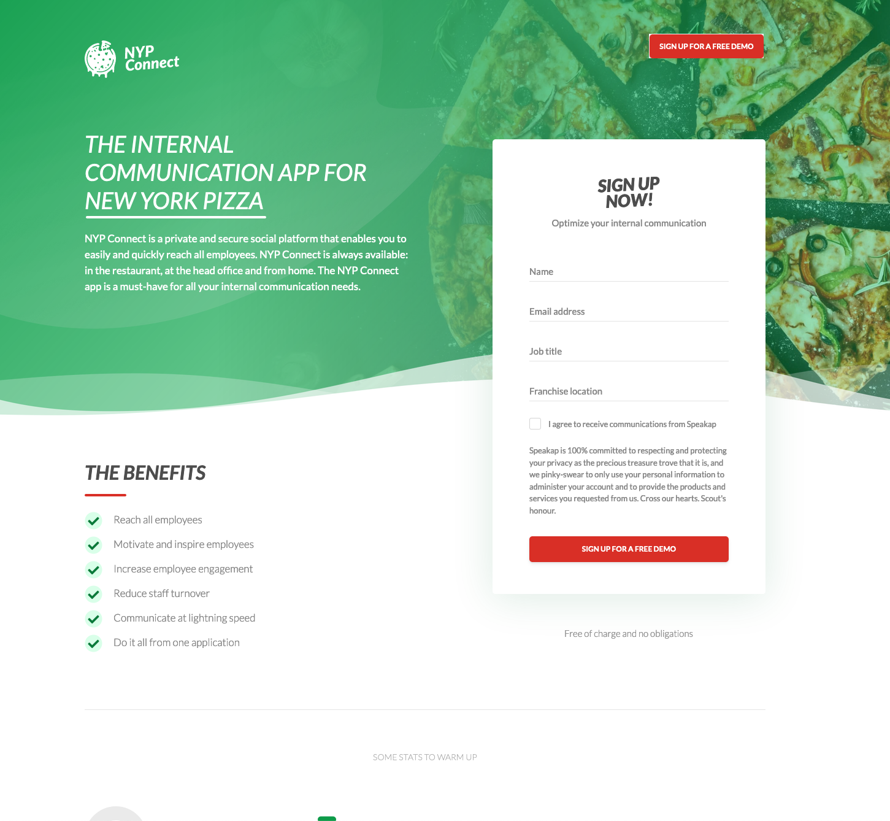

# New York Pizza - Landing Page

You directly open the `index.html` file.

Hi there, first of all I would like to thank you for your time. Below, I listed some statistics about my work experience and suggestions on this project. Thanks.

- I've spend 1-work-day for the whole project. (Coding & optimizations)
- It's a cool design and nice colors, I enjoyed while working on it.

## Suggesitons
- More relevant background image
	- Using more product-relevant background image in the sections may decrease the bounce rate and it can help the user to better understand what the page is talking about. Pizza image on the top makes you think the page is an online pizza shop.
- Shorten the Sign Up Form
	- The shorter the form, the higher the filling rate. IF these details are essentials for our company, we may ask them right after they provide the email details with us.
	- Longer waivers may cause users to have more doubts when filling out the form.
	
- Sticky header navigation (Like you have on your homepage)
	- Sticky header navigation can be added to the top of the page and a sign up button can be added to the navigation. So even if the user scrolls on the page, the sign up button is always available.
	

## Issues I had...
- I fetch the both fonts (Lato & Merriweather) from Google Fonts but there is an issue on font-weight. For example, the weight is 400 in design but when I apply 400 on the browser it looks bolder than the one in design.
- I animated the charts in `Benefits` section, but it's not in the mobile view because I couldn't properly export the mobile version of the chart from Sketch.
- Since I didn't have the pro version of Font Awesome library, I tried draw closest images on icons.

## If I had more time, I would...
> It was really though week for me, I had worked at least 9 hours for my current job since we're running a campaign. So, I couldn't implement everything I want, sorry for that.

- absolutely work on a11y, I never miss the a11y features whilw working on landing
- implement animation for testimonials crousal
- set more sustainable SASS system